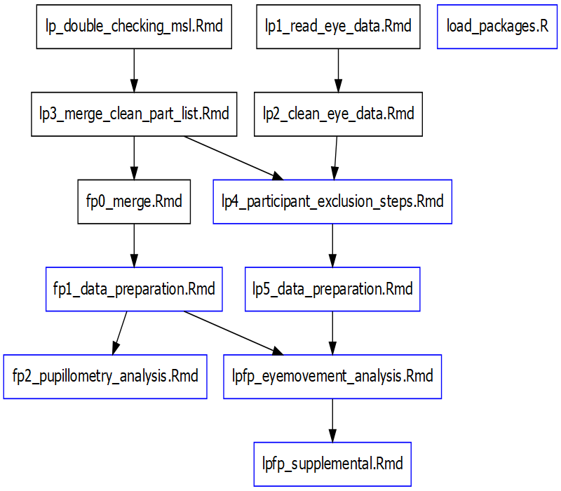

# Readme  for "Keeping track of language: Can monolingual and bilingual infants associate a speaker with the language they speak?"
Created by Esther Schott (esther.schott@mail.concordia.ca)

This repository contains the analysis code associated with the research manuscript *Keeping track of language: Can monolingual and bilingual infants associate a speaker with the language they speak?*. You can find the associated OSF project, including raw data files and the stimuli used in the studies, at: https://osf.io/psbxv/?view_only=a4fa383dfe7144c7bf0173e1f9c30a43

### Repository overview

**scripts** - this folder contains the scripts used to generate the analysis and manuscript, along with a Groundhog package library for reproducability. To run the analysis, open the ```KeepingTrackOfLanguage2023.Rproj``` file located in the root folder using RStudio and then run the ```lpfp_eyemovement_analysis.Rmd```, ```fp2_pupillometry_analysis.Rmd```, ```lpfp_supplemental.Rmd```  files to reproduce the analysis.

#### Pre-processing steps that are not shared 
These scripts contain data with identifyable information (date of birth, date of participantion, non-random participant id) and are not shared:
- ```lp1_read_eye_data.Rmd``` reads in eyetracking data, combines files into one (2 projects on tobii, each with different subsets of participants...), exclude attentiongetters and times where no movies is presented
- ```lp2_clean_eye_data.Rmd``` cleaning of participant naming convention, check that no two participants have same name, check that all participants are present
- ```lp3_merge_clean_part_list.Rmd``` data cleaning for demographics, language mixing
- ```fp0_merge.Rmd``` merge eyetracking with info from demographics and master subject list, de-identify data (not shared)

#### Shared Scripts
- ```load_packages.R``` This is the library of specific packages and versions used in the original analysis script, to make reproducibility of the analysis more straightforward.
- ```lp4_participant_exclusion_steps.Rmd``` read in demographics and main subject list, check for pre-data analysis exclusion criteria (health, language,..) 
- ```fp1_data_preparation.Rmd``` merge eye data and participant info, check for pre-data analysis exclusion criteria (health, language,..) 
- ```lpfp_eyemovement_analysis.Rmd``` merge lp (Study 1) and fp (Study 2), run analysis on eye movement data
- ```fp2_pupillometry_analysis.Rmd``` pupillometry analysis script
- ```lpfp_supplemental.Rmd``` supplemental materials for manuscript

see below for a schematic overview of the scripts, scripts in blue contain de-identified data and are shared



**data** - this folder contains raw data. however  none of these are shared because they contain identifying information. for de-identified datasets for reanalysis, see ```output/processed data```
- info on trials for Study 2 (FP): ```facePrince_trial_info.csv```
- ```age_ranges.csv``` contains info on age ranges for each age group


**output** this contains the processed data & output

- ***processed_data*** - This file contains preprocessed data
  + ```MainSubjList-lp4.Rdata``` all info on participants for Study 1 (LP)
  + ```lp_part_info.Rdata``` de-identified demographics & language mixing info for lp4 script for Study 1 (LP)
  + ```fp_part_info.Rdata``` de-identified demographics & language mixing info for fp1 script for Study 2 (FP)
  + ```fullData-lp2.Rdata``` eye data for lp5 script
  + ```fullData_lp5.Rdata``` output from lp5 script, input for ```lpfp_eyemovement_analysis.Rmd```
  
  + ```FacePrince_raw_eye_data.Rdata``` output from fp0 script, input for ```fp1_data_preparation.Rmd``` 
  + ```fp_preprocessed.Rdata``` output from fp1 script, input for ```lpfp_eyemovement_analysis.Rmd``` 
  + ```fp_pupil_preprocessed.Rmd``` output from fp1 script, input for   ```fp2_pupillometry_analysis.Rmd```
  + folder **csv_files**
  


- **figures** - this folder contains figures generated by the analysis script.


- **tables** - this folder contains tables generated by the analysis script.

